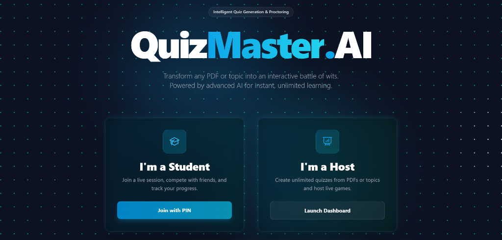
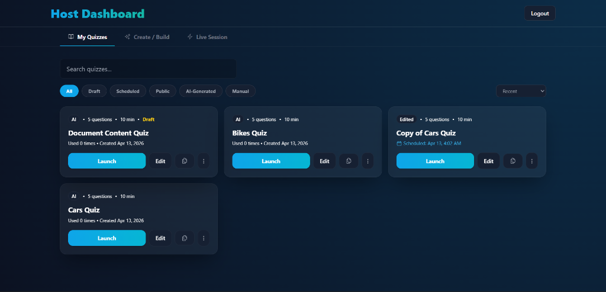
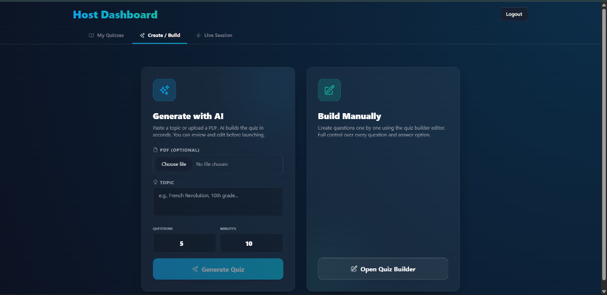
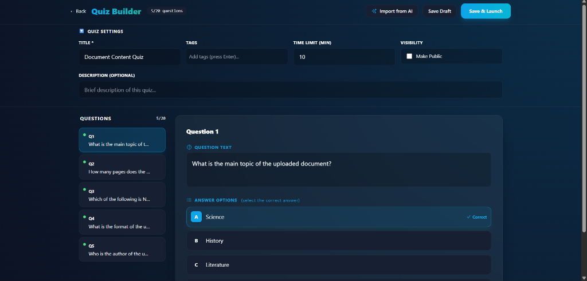
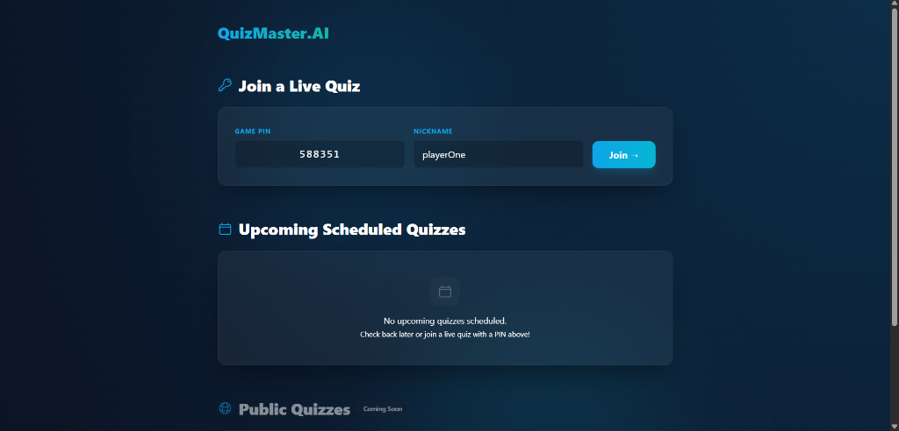
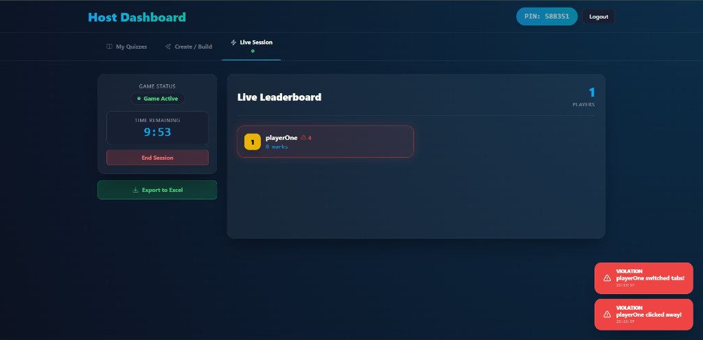
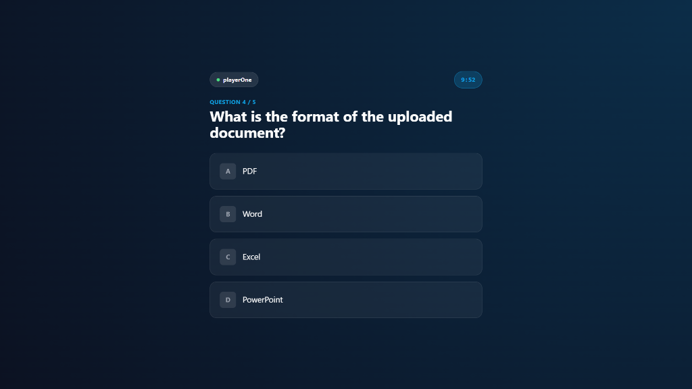

# QuizMaster.AI

**Transform any PDF or topic into an interactive battle of wits. Powered by advanced AI for instant, unlimited learning.**




## Overview
QuizMaster.AI is a real-time, multiplayer quiz platform that leverages OpenAI to automatically generate quizzes from any topic or uploaded PDF document. It features a seamless Host-Player interaction model with robust anti-cheating mechanisms, making it perfect for classrooms, corporate training, or fun trivia nights.

## Core Functions

### 1. Advanced AI-Powered Quiz Generation
- **Intelligent Content Extraction**: Upload study materials or enter a topic, and the AI rigorously extracts core educational concepts, tech details, and facts while strictly **avoiding** lazy summary or meta-document questions.
- **RAG Pipeline for PDFs**: PDF uploads are processed through a full Retrieval-Augmented Generation pipeline — chunked, embedded, and semantically searched — for vastly superior quiz quality compared to raw text injection.
- **Customizable**: Set the number of questions and time limits per quiz.

### 2. Advanced Host Dashboard & Quiz Management
- **Custom Quiz Builder**: Manually construct rigorous quizzes using an intuitive custom builder, complete with tailored questions and distinct answer options.
- **Quiz Draft & Storage Feature**: Automatically save works-in-progress as drafts, and persistently store all your past successfully generated/built quizzes for easy retrieval and replay at any time!
- **Live Leaderboard**: Watch player scores update in real-time as they answer questions during a live session.
- **PDF Session Reports**: Download professional, multi-page PDF reports with player breakdown, question analysis, and integrity scores.
- **Detailed Excel Exports**: The final generated `.xlsx` report contains thorough breakdowns of player scores and explicit violation tracking (e.g., Screenshot Attempts, Fullscreen Exits).

### 3. Interactive Player Experience
- **Fluid & Modern UI**: Smooth animations, instant feedback on answers, and a highly competitive atmosphere to keep users engaged.
- **Easy Join**: Players join using a unique Game PIN—no account required.
- **Result Analysis**: Players can download a detailed Word document solution sheet after the game.

### 4. Impenetrable Anti-Cheating System
To ensure fair play and exam integrity, the application strictly monitors player activity:
- **Fullscreen Enforcement (Exam Mode)**: Before answering any questions, players must explicitly grant permission to enter **Fullscreen Mode**. Exiting fullscreen instantly pauses their game and logs an immediate violation. If they refuse to return, it persistently tracks "Not Fullscreen" violations natively on the Host's dashboard!
- **Screenshot & Snipping Tool Detection**: Detects OS-level combinations like `PrintScreen`, `Win+Shift+S`, and `Ctrl+P`. The screen immediately blurs, a violation is sent to the Host, and the clipboard is overwritten.
- **Focus Tracking**: Detects if the player switches tabs or minimizes the window.
- **Blur Detection**: Detects if the player clicks away from the quiz area.

---

## Tech Stack
- **Frontend**: React, TailwindCSS, Socket.io-client
- **Backend**: Node.js, Express, Socket.io, MongoDB
- **AI**: OpenAI API (GPT-3.5/4) via OpenRouter
- **RAG**: PDF chunking → OpenAI embeddings → In-memory vector store → Context-aware generation
- **Reports**: PDFKit for professional A4 session reports
- **Testing**: Jest + Supertest + MongoMemoryServer
- **CI/CD**: GitHub Actions (multi-node matrix, Docker build verification)
- **Infrastructure**: Docker + Docker Compose + Nginx reverse proxy

---

## Installation

### Option 1: Docker (Recommended)

1. **Clone the repository**
   ```bash
   git clone https://github.com/yourusername/ai-quiz-builder.git
   cd ai-quiz-builder
   ```

2. **Configure environment**
   ```bash
   cp .env.docker .env.docker.local
   # Edit .env.docker with your actual values:
   #   OPENAI_API_KEY=your_key_here
   #   JWT_SECRET=your_secret_here
   ```

3. **Start all services**
   ```bash
   npm run docker:up
   # Or directly:
   docker-compose up --build
   ```

4. **Access the app**
   - Frontend: http://localhost
   - Backend API: http://localhost:5000
   - MongoDB: localhost:27017

5. **Other Docker commands**
   ```bash
   npm run docker:down    # Stop all services
   npm run docker:logs    # Tail logs from all services
   ```

### Option 2: Local Development

1. **Clone the repository**
   ```bash
   git clone https://github.com/yourusername/ai-quiz-builder.git
   cd ai-quiz-builder
   ```

2. **Install Dependencies**
   ```bash
   npm run install-all
   ```

3. **Environment Setup**
   Create a `.env` file in the `server` directory:
   ```env
   PORT=5000
   MONGODB_URI=your_mongodb_connection_string
   OPENAI_API_KEY=your_openai_api_key
   JWT_SECRET=your_jwt_secret
   CLIENT_URL=http://localhost:5173
   ```

4. **Run the Application**
   ```bash
   # Terminal 1: Start server
   cd server && npm run dev

   # Terminal 2: Start client
   cd client && npm run dev
   ```

---

## Testing

The server has a comprehensive Jest test suite using MongoMemoryServer (no external database required).

```bash
# Run all tests
cd server && npm test

# Run with coverage report
cd server && npm run test:coverage
```

### Test Coverage

| Suite | Tests | Description |
|-------|-------|-------------|
| `auth.test.js` | 7 | Register (success, duplicate, validation), Login (JWT, wrong password, non-existent) |
| `quiz.test.js` | 7 | Generate (topic, PDF), Get by ID, List host quizzes, Delete |
| `session.test.js` | 6 | Start session (PIN, validation, auth), Get by PIN, End session |

All tests use real Mongoose models against MongoMemoryServer and mock only external APIs (OpenAI).

---

## RAG Pipeline (PDF-to-Quiz)

When a PDF is uploaded, it goes through a 4-stage Retrieval-Augmented Generation pipeline:

```
PDF Upload → Chunking → Embedding → Vector Store → Context Retrieval → LLM Generation
```

1. **PDF Chunking** (`services/pdfChunker.js`): Parses PDF text and splits into ~500-token segments with 50-token overlap
2. **Embedding** (`services/embedder.js`): Embeds chunks using OpenAI `text-embedding-3-small` in batches of 20
3. **Vector Store** (`services/vectorStore.js`): In-memory cosine similarity search over embeddings
4. **RAG Generation** (`services/ragQuizGenerator.js`): Retrieves top-8 relevant chunks, builds context, prompts GPT-4o-mini with structured output format

This produces significantly higher quality questions compared to the old approach of injecting raw PDF text into prompts, because:
- Only relevant sections are used as context (not the full document)
- Semantic search finds the most informative passages
- The structured prompt enforces consistent output format

---

## PDF Session Reports

After completing a quiz session, hosts can download a professional A4 PDF report.

**Report Sections:**
1. **Session Summary** — Quiz title, PIN, duration, top 3 players podium
2. **Player Breakdown** — Table with rank, score, correct/wrong/unanswered, violations
3. **Question Analysis** — Per-question correct %, most common wrong answer
4. **Integrity Report** — Violation counts by type, per-player log, overall integrity score

**Endpoints:**
- `GET /api/sessions/:sessionId/report/pdf` — Full session report (host JWT required)
- `GET /api/sessions/:sessionId/report/player/:playerId` — Personal player report (no auth)

---

## CI/CD

GitHub Actions workflows are configured for:

### Test Workflow (`.github/workflows/test.yml`)
- Triggers on push to `main`/`develop` and PRs to `main`
- Tests against Node.js 18.x and 20.x
- Uploads coverage reports as artifacts

### Docker Build Workflow (`.github/workflows/docker-build.yml`)
- Triggers on push to `main`
- Verifies both server and client Dockerfiles build successfully

---

## Environment Variables

| Variable | Description | Required |
|----------|-------------|----------|
| `PORT` | Server port (default: 5000) | No |
| `MONGODB_URI` | MongoDB connection string | Yes |
| `JWT_SECRET` | Secret for JWT signing | Yes |
| `OPENAI_API_KEY` | OpenAI/OpenRouter API key | Yes |
| `CLIENT_URL` | Frontend URL for CORS (default: http://localhost:5173) | No |
| `NODE_ENV` | Environment mode (production/development/test) | No |

---

## Walkthrough

### Step 1: Landing Page
Choose your role on our newly designed, interactive platform. Hosts can access the dashboard to create quizzes, while students can jump straight into an existing session with a Game PIN.


### Step 2: Host Dashboard - My Quizzes
The central hub for Hosts. Neatly view your works-in-progress (Drafts), AI-Generated quizzes, manually created quizzes, and easily launch them anytime.


### Step 3: Create & Build Hub
When creating a new quiz, effortlessly choose between instantly generating a sophisticated quiz via AI (from a PDF or Topic) or explicitly constructing one from scratch.


### Step 4: Custom Quiz Builder
If you prefer explicit control, our manual Quiz Builder allows you to meticulously craft individual questions, define correct distinct answers, add tags, and save drafts!


### Step 5: Player Join Lobby
Students can seamlessly join live sessions or scheduled quizzes using a secure 6-digit Game PIN—no frustrating accounts or logins required!


### Step 6: Live Session Host Monitoring
Hosts gain an immediate, real-time leaderboard alongside critical security alerts. Any attempts to exit Fullscreen or switch tabs will immediately flash **Red Violation Notifications** natively on the Host's screen.


### Step 7: Player Gameplay & Security Enforcement
Once connected, players must answer questions under strict Time and Fullscreen constraints. Our completely distraction-free interface ensures ultimate focus.


---

## Project Structure

```
ai-quiz-builder/
├── client/                    # React frontend (Vite + TailwindCSS)
│   ├── src/
│   │   ├── pages/             # HostDashboard, PlayerGame, etc.
│   │   ├── components/        # QuizCard, ScheduleModal, etc.
│   │   └── context/           # SocketContext
│   └── package.json
├── server/                    # Express backend
│   ├── models/                # Quiz, User, Session (Mongoose)
│   ├── routes/                # auth, quizzes, sessions
│   ├── services/              # RAG pipeline + PDF reports
│   │   ├── pdfChunker.js      # PDF → text chunks
│   │   ├── embedder.js        # Text → OpenAI embeddings
│   │   ├── vectorStore.js     # In-memory cosine similarity
│   │   ├── ragQuizGenerator.js # RAG context → GPT quiz
│   │   └── reportGenerator.js  # PDFKit session reports
│   ├── middleware/            # JWT auth
│   ├── socket/                # Socket.io game logic
│   ├── __tests__/             # Jest test suite
│   ├── app.js                 # Express app (testable)
│   ├── index.js               # Server entry (listen)
│   └── package.json
├── .github/workflows/         # CI/CD
│   ├── test.yml               # Jest + coverage
│   └── docker-build.yml       # Docker verification
├── Dockerfile.server          # Node.js server image
├── Dockerfile.client          # Multi-stage nginx image
├── docker-compose.yml         # Full stack orchestration
├── docker-compose.override.yml # Dev overrides (hot reload)
├── nginx.conf                 # Reverse proxy config
├── .env.docker                # Docker env template
└── README.md
```
